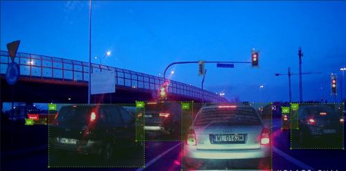
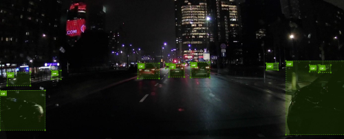
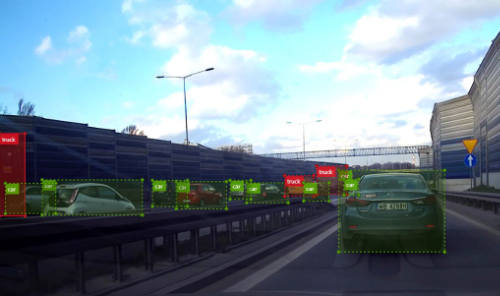
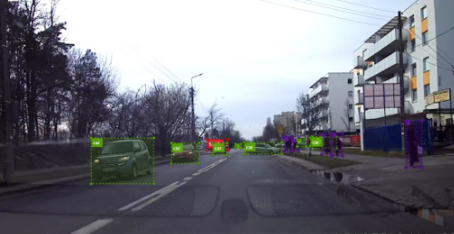
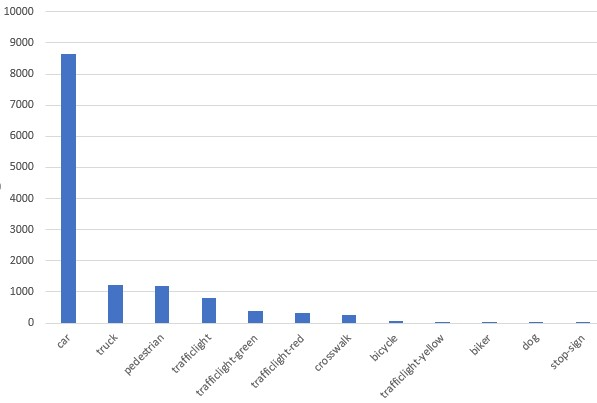

# Annotated Driving Dataset - Poland

Note: The dataset is free to use. It's annotated manualy and could contain errors.
Images for the data set are stored in a zip file on a separate server. Link to download below.

## Dataset

The dataset includes driving in Poland (currently Warsaw only) during daylight and nightlight conditions. The images are captured using car dashcams running at full resolution of 1920x1200. From the video files two frames per second are captured as images. The dataset is annotated manualy by [Sethai](https://github.com/sethai) using the Microsoft [VOTT](https://github.com/microsoft/VoTT) software

### Sample images:

### Dataset download

<table>
    <tr>
        <td>Size</td>
        <td>4.3 GB</td>
    </tr>
    <tr>
        <td>Download</td>
        <td><a href="http://konradobah.pl/www/dataset_poland/dataset.zip">dataset</td>
    </tr>
</table>

## Dataset description

#### Labels
- car
- truck
- Pedestrian
- trafficlight
- trafficlight-green
- trafficlight-red
- trafficlight-yellow
- trafficlight-green-arrow
- crosswalk
- bicycle
- biker
- dog
- stop-sign

#### CSV Format
- image name
- xmin
- ymin
- xmax
- ymax
- label
- time of day

#### Dataset split (time of day)
<table>
    <tr>
        <td>Day</td>
        <td>1334 (assets) ; 19303 (tags)</td>
    </tr>
    <tr>
        <td>Night</td>
        <td>731 (assets) ; 5724 (tags)</td>
    </tr>
</table>    

#### Labels count

<table>
    <tr>
        <td>car</td>
        <td>12676</td>
    </tr>
    <tr>
        <td>truck</td>
        <td>1914</td>
    </tr>
    <tr>
        <td>pedestrian</td>
        <td>2284</td>
    </tr>
    <tr>
        <td>trafficlight</td>
        <td>948</td>
    </tr>
    <tr>
        <td>trafficlight-green</td>
        <td>424</td>
    </tr>
    <tr>
        <td>trafficlight-red</td>
        <td>397</td>
    </tr>
    <tr>
        <td>crosswalk</td>
        <td>453</td>
    </tr>
    <tr>
        <td>bicycle</td>
        <td>136</td>
    </tr>
    <tr>
        <td>trafficlight-yellow</td>
        <td>21</td>
    </tr>
    <tr>
        <td>biker</td>
        <td>34</td>
    </tr>
    <tr>
        <td>dog</td>
        <td>6</td>
    </tr>
    <tr>
        <td>trafficlight-green-arrow</td>
        <td>5</td>
    </tr>    
    <tr>
        <td>stop-sign</td>
        <td>5</td>
    </tr>    
</table>
